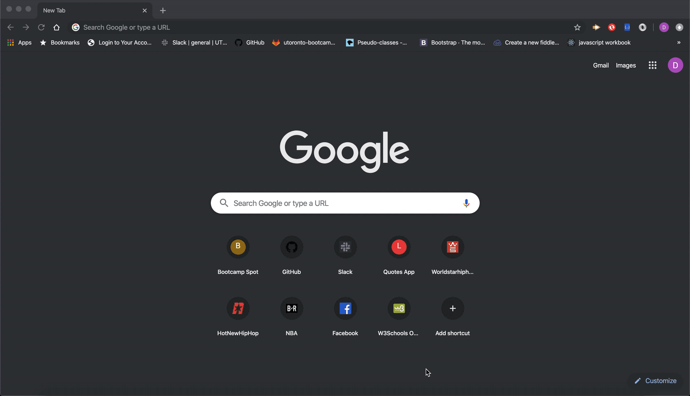

# Eat-The-Burger

Description: A resturant application that allows users to input the names of the burgers they would like to eat. The application allows the user to add burgers, and list the burgers in a devoured section indication the burger has been eaten. 

Repository:

https://github.com/davidgeht/Eat-The-Burger

Technologies Used:

Node:

Node.js will be need to run the application which is available to install from here.

NPM will be required to all you to install the necessary packages to run the application.

NPM Packages:

- Express
- Express Handlebars
- Mysql

Using the Application:

To use the application simply click on this link: https://polar-dawn-91505.herokuapp.com/

Preview:

